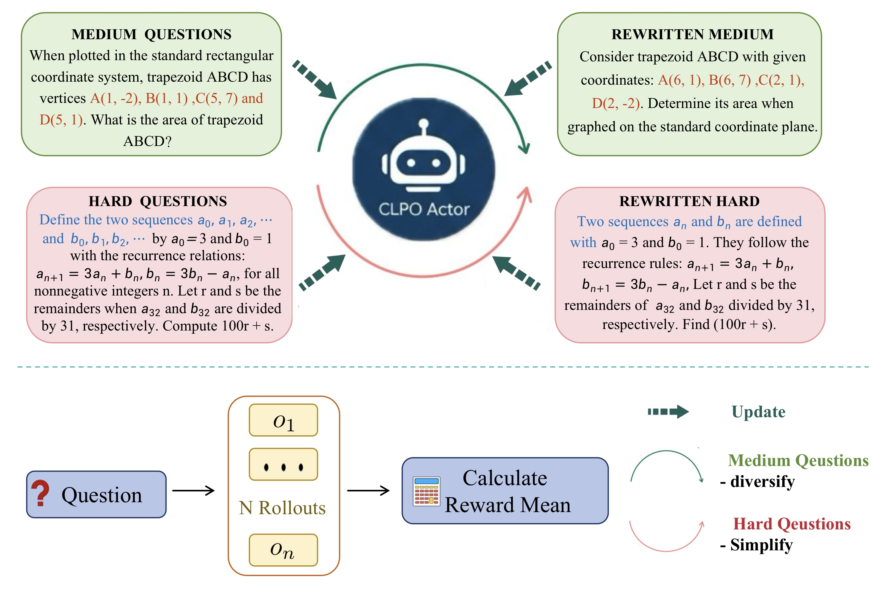
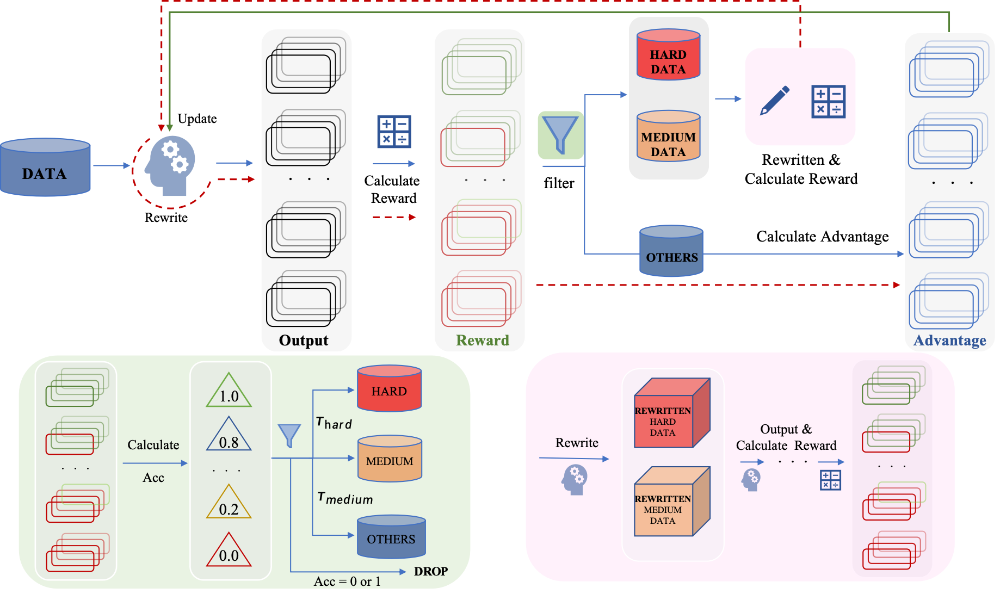

# CLPO: CURRICULUM LEARNING MEETS POLICY OPTIMIZATION FOR LLM REASONING

<div align="center">

**[🌐 Website](https://csuking.github.io/CLPO.github.io/)** • **[📜 Paper]** • **[🐱 GitHub](https://github.com/csuking/CLPO)** • **[🐦 Twitter]**

</div>

<div align="center">

</div>

*Figure 1: CLPO achieves significant improvements across mathematical reasoning benchmarks through curriculum learning and policy optimization, outperforming state-of-the-art methods on Qwen3-8B.*

## 🔥 News

- [2025/09/29] **Full code for CLPO training released.**
- [2025/09/29] **CLPO paper, repository, and project page released.**

## 💡 Introduction

To address this challenge, we propose CLPO (Curriculum-guided Learning for Policy Optimization), a novel framework that actualizes a paradigm of Guided Self-Evolution (Silver et al., 2018). The core innovation of CLPO is its elevation of rollout information from a mere reward calculation signal to the central driver for constructing a dynamic curriculum. It employs Online Curriculum Learning to assess problem difficulty in real-time, which in turn guides an Adaptive Problem Restructuring mechanism to diversify medium problems and simplify hard ones. Furthermore, we introduce Difficulty-aware Policy Optimization, which integrates the curriculum signal into the optimization process via dynamic KL regularization. Through these mechanisms, CLPO transforms the training process into a structured, adaptive curriculum that co-evolves with the model's capabilities, all without any external dependencies.

<div align="center">

</div>

*Figure 2: The CLPO workflow showing the curriculum learning process with problem difficulty assessment, curriculum design, and adaptive policy optimization.*

## 📊 Main Results on Qwen3-8B

| Method | Optimization Policy | MATH 500 | Minerva Math | Olympiad Bench | AMC23 | AIME24 | MMLU Pro | Theorem QA | GPQA Diamond | Avg |
|--------|-------------------|----------|--------------|----------------|-------|--------|----------|------------|--------------|-----|
| **Supervised Fine-Tuning (SFT)** |
| RAFT | Ranking-Based Imitation | 76.20 | 35.58 | 36.86 | 50.00 | 26.67 | 65.93 | 43.50 | 36.76 | 46.44 |
| Refinement FT | Guided Refinement | 83.20 | 47.58 | 40.71 | 70.00 | 33.33 | 67.84 | 41.29 | 34.47 | 52.30 |
| Critique FT | Learning to Critique | 79.00 | 35.23 | 39.64 | 67.50 | 33.33 | 63.16 | 46.00 | 34.84 | 49.84 |
| CITL-FT | Mixed-Data SFT | 76.40 | 37.20 | 38.57 | 62.50 | 30.00 | 66.13 | 44.25 | 36.36 | 48.93 |
| **Reinforcement Learning with Verifiable Rewards (RLVR)** |
| GRPO | Group-Based RL | 89.20 | 51.47 | 57.40 | 82.50 | 43.33 | 69.86 | 54.75 | 47.80 | 62.04 |
| DAPO | Dynamic Sampling | **91.20** | 53.31 | 63.80 | 87.50 | 46.67 | 70.01 | 55.00 | 48.48 | 64.50 |
| LUFFY | Off-Policy Imitation | 89.40 | 52.94 | 58.80 | 85.00 | 40.00 | 70.34 | 58.25 | 49.49 | 63.03 |
| Critique-GRPO (Simple) | Critique-Driven RL | 89.40 | 52.57 | 60.20 | 87.50 | 40.00 | 70.13 | 59.00 | 48.63 | 63.43 |
| Critique-GRPO (CoT) | Critique-Driven RL | **91.20** | 61.50 | 63.80 | **90.00** | 46.67 | 70.98 | 59.50 | 50.50 | 66.77 |
| **CLPO (Ours)** | **Guided Self-Evolution** | **89.60** | **76.10** | **77.50** | **90.00** | **50.00** | **72.39** | **71.63** | **62.63** | **73.73** |

## 🚀 Quick Start

### ⚙️ Setup

We recommend using Conda to manage your environment. Run the following commands to setup your environment:

```bash
git clone https://github.com/csukin/CLPO.git && cd CLPO
conda create -n clpo python=3.10
conda activate clpo
pip install torch==2.7.1 --index-url https://download.pytorch.org/whl/cu126
pip install -r requirements.txt
```


### ⚡️ Training

To train CLPO on Qwen3-8B with our configuration:

```bash
# Configure paths in the script
bash scripts/clpo_qwen3_8b.sh
```

Key CLPO configuration parameters:
- `clpo_rewrite_mode="both"`: Enable both hard and medium problem rewriting
- `clpo_hard_acc_upper=0.3`: Upper accuracy threshold for hard problems
- `clpo_med_acc_lower=0.3`: Lower accuracy threshold for medium problems  
- `clpo_med_acc_upper=0.7`: Upper accuracy threshold for medium problems

## 🔧 Key Features

### Guided Self-Evolution
- **Problem Rewriting**: Automatically generates problem variations
- **Difficulty Assessment**: Classifies problems into hard, medium, and easy categories
- **Adaptive Training**: Focuses learning on appropriately challenging problems

### CLPO Configuration
```bash
# CLPO specific settings
clpo_rewrite_mode="both"           # Rewrite both hard and medium problems
clpo_hard_acc_upper=0.3           # Hard problem threshold
clpo_med_acc_lower=0.3            # Medium problem lower bound
clpo_med_acc_upper=0.7            # Medium problem upper bound
clpo_save_rewrite_data=true       # Save rewritten data for analysis
```

## 📈 Performance Analysis

CLPO demonstrates significant improvements across all benchmarks:

- **+9.23 points** average improvement over best baseline (Critique-GRPO CoT)
- **+22.79 points** improvement on Minerva Math
- **+13.70 points** improvement on Olympiad Bench
- **+12.13 points** improvement on Theorem QA

## 🏗️ Architecture

The CLPO framework consists of three main components:

1. **Problem Rewriter**: Generates semantic-preserving problem variations
2. **Difficulty Classifier**: Assesses problem complexity based on model performance
3. **Adaptive Trainer**: Optimizes learning focus on challenging but solvable problems

## 📚 Citation

If you find this work helpful, please consider citing our paper:

```bibtex
@article{clpo2025,
  title={CLPO: Guided Self-Evolution for Mathematical Reasoning},
  author={Your Name and Others},
  journal={arXiv preprint arXiv:XXXX.XXXXX},
  year={2025}
}
```

## 🙏 Acknowledgements

We thank the authors of veRL for providing the excellent training framework that enabled this work. We also acknowledge the contributions of the mathematical reasoning community for providing high-quality benchmarks and datasets.

## 🌟 Star History

[](https://star-history.com/#csukin/CLPO&Date)

## 📄 License

This project is licensed under the Apache-2.0 License - see the [LICENSE](LICENSE) file for details.